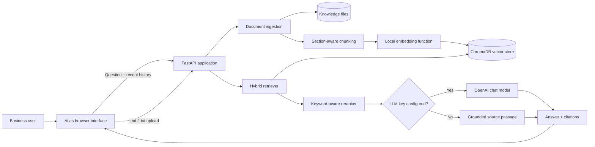
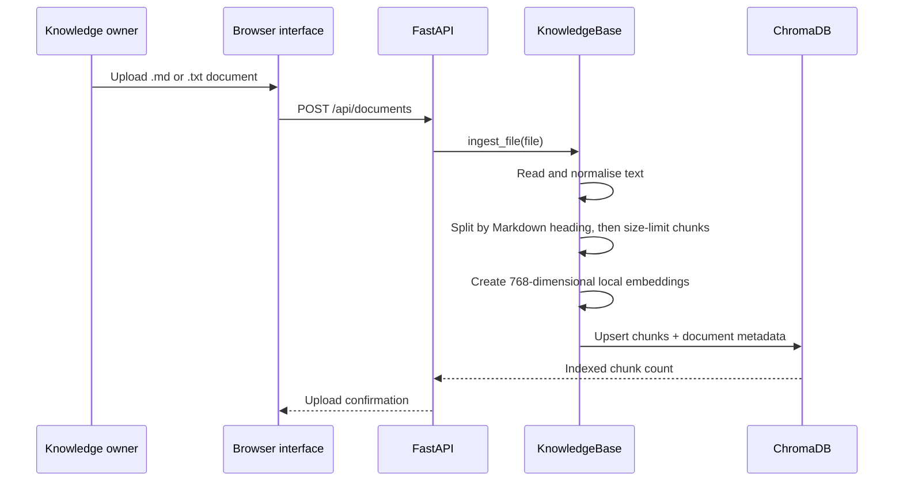
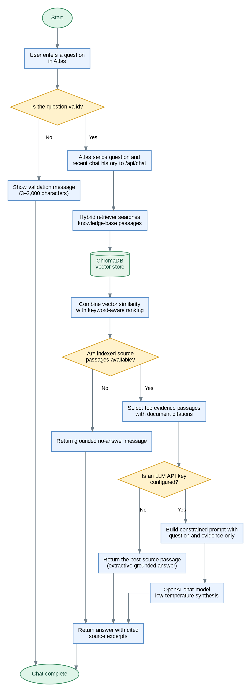
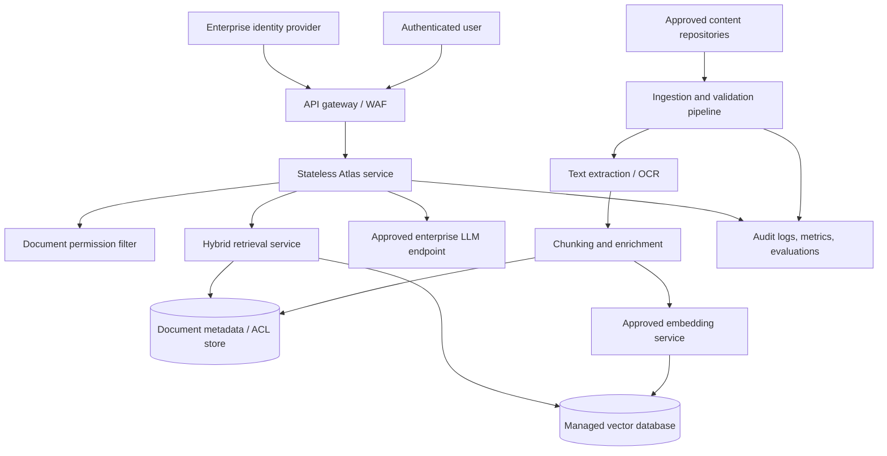

# Atlas Knowledge Base Assistant — High-Level Architecture

## 1. Purpose

Atlas is a Retrieval-Augmented Generation (RAG) assistant for answering questions over an approved knowledge base. It is designed for FAQ, policy, process-guide, product-support, and onboarding use cases where answers must be traceable to source material.

The application has two operating modes:

- **Grounded demonstration mode**: retrieves the best supporting passage and presents it directly with citations. This mode operates without an LLM credential.
- **LLM synthesis mode**: retrieves evidence first, then asks an LLM to compose a concise answer using only that evidence. The response includes numbered source references.

## 2. Architecture at a glance

## 3. Logical components

| Component | Responsibility | Current implementation |
| --- | --- | --- |
| Web interface | Lets users ask questions, review cited evidence, and upload knowledge files. | Static HTML, CSS, and JavaScript in `static/`. |
| Application API | Serves the interface, validates requests, coordinates retrieval and answer generation. | FastAPI application in `app/main.py`. |
| Knowledge repository | Stores source files prior to ingestion. | Local `knowledge/` directory. |
| Ingestion pipeline | Reads supported files, splits them into retrievable passages, creates metadata and vectors. | `KnowledgeBase.ingest_file` in `app/rag.py`. |
| Vector store | Persists passage text, metadata, and embeddings; supports vector similarity search. | Local ChromaDB collection at `data/chroma`. |
| Hybrid retriever | Combines vector similarity with exact keyword relevance, then returns the best passages. | `KnowledgeBase.retrieve`. |
| Answer generator | Produces either an evidence-preserving extractive response or an LLM-synthesised answer. | `grounded_fallback` and `synthesise` in `app/main.py`. |
| Configuration | Holds paths, chunk sizing, and optional LLM configuration. | Environment variables loaded through `.env` and `app/settings.py`. |

## 4. Document ingestion and indexing flow

Documents enter the system either through the browser upload control or by being placed in the `knowledge/` directory. The current demonstrator accepts Markdown (`.md`) and text (`.txt`) files.

### Chunking approach

The splitter first detects Markdown headings at levels one to three. This keeps a policy section or FAQ question-and-answer pair together, which is important for grounding. A very large section is split again at a sentence or newline boundary using:

- chunk size: 900 characters;
- overlap: 150 characters.

Each chunk is stored with a stable identifier (`document-name:chunk-index`) and metadata containing the document name and readable title.

### Index lifecycle

On application startup, Atlas rebuilds the `knowledge_base` Chroma collection from all supported files in `knowledge/`. This gives the demonstrator a simple, repeatable state. A browser upload is also indexed immediately. Because source files are kept in the knowledge directory, uploaded content is included in the next rebuild.

## 5. Question answering flow

The following diagram uses the requested operational-flowchart format: green start/end nodes, yellow decisions, blue process steps, and a green data-store symbol.

### Chat-flow explanation

| Flow stage | What happens | Grounding purpose |
| --- | --- | --- |
| Input and validation | Atlas accepts a user question and a limited recent conversation history. The API rejects missing, too-short, or overly long questions. | Prevents malformed requests from reaching the retrieval and generation steps. |
| Retrieval | The system searches ChromaDB for vector-similar chunks, then reranks all indexed chunks using exact keyword relevance. | Finds the most relevant evidence instead of answering from model memory. |
| Evidence decision | Atlas checks whether the knowledge base contains indexed source passages. | Allows the bot to say that the knowledge base lacks an answer when no source material is available. |
| Answer-mode decision | Atlas checks whether an LLM API key is configured. | The application remains useful and grounded even without a model credential. |
| Extractive path | Without an LLM, Atlas returns the best matching source passage. | No content is generated beyond the source evidence. |
| LLM synthesis path | With an LLM, Atlas sends only the question, selected passages, and limited history to a low-temperature model with a constrained prompt. | Keeps the generated answer bounded by retrieved evidence and requests citations. |
| Display | The interface presents the answer with document titles, excerpts, and relevance indicators. | Lets the user inspect the evidence behind the answer. |

### Hybrid retrieval

Atlas intentionally uses two signals:

1. **Vector similarity** from ChromaDB, using a 768-dimensional, normalised signed-hash embedding. It provides an offline, deterministic demonstration without downloading a model.
2. **Keyword-aware reranking**, which rewards exact query terms and gives rarer terms more weight. This is especially useful for policy names, numbers, FAQ headings, product terms, and other precise questions.

The final rank gives priority to keyword evidence and uses vector similarity as a secondary signal. The top four passages are returned as citations; in extractive mode, only the first passage is used as the answer, which avoids combining unrelated text.

## 6. Grounding and citation controls

Grounding is a deliberate application boundary rather than a prompt-only feature.

| Control | How Atlas applies it |
| --- | --- |
| Retrieval before generation | Every chat request first retrieves source passages. |
| Bounded context | Only the retrieved passages are provided to the LLM. |
| Constrained prompt | The LLM is instructed to use only supplied context and state when evidence is insufficient. |
| Low creativity | LLM temperature is set to `0.1`. |
| Source visibility | The UI shows each source document, matching indicator, and excerpt. |
| Safe non-LLM mode | Without an LLM key, the system returns the best source passage rather than inventing a summary. |
| No-answer behaviour | When no passages exist, Atlas explicitly says the knowledge base does not contain an answer. |

These controls reduce unsupported answers, but they do not replace document governance or formal evaluation. The cited excerpt is the user-facing evidence for each answer.

## 7. API surface

| Endpoint | Purpose | Key input | Output |
| --- | --- | --- |
| `GET /` | Serves the Atlas interface. | None | HTML page. |
| `GET /api/status` | Health-style summary for integrations or diagnostics. | None | Indexed chunk count and whether LLM mode is enabled. |
| `POST /api/chat` | Retrieves evidence and answers a user question. | `question`, optional recent `history` | `answer`, `sources`. |
| `POST /api/documents` | Saves and indexes a new document. | Multipart `.md` or `.txt` file | File name and indexed chunk count. |

`POST /api/chat` validates questions between 3 and 2,000 characters and limits supplied conversation history to eight messages.

## 8. Data model and storage

### Source files

Knowledge files are stored as plain text under `knowledge/`. They remain the human-readable source of truth in this demonstrator.

### Chroma collection

The persistent Chroma collection is named `knowledge_base` and holds:

- chunk identifier;
- chunk text;
- vector embedding;
- document file name;
- human-readable document title.

The Chroma persistence directory defaults to `data/chroma`; it can be changed using `CHROMA_PATH`.

### Runtime configuration

| Variable | Default | Purpose |
| --- | --- | --- |
| `KNOWLEDGE_PATH` | `knowledge/` | Location of source documents. |
| `CHROMA_PATH` | `data/chroma` | Local Chroma persistence location. |
| `OPENAI_API_KEY` | Not set | Enables LLM synthesis when configured. |
| `OPENAI_MODEL` | `gpt-4o-mini` | Chat model used for synthesis. |

## 9. Current trust boundaries and constraints

Atlas is a local demonstration architecture. The following limitations are intentional to keep the project focused and should be addressed before using it with sensitive or enterprise knowledge:

- The current upload endpoint has no authentication, role checks, malware scanning, or document approval workflow.
- Local files and local Chroma persistence are not a multi-user, highly available storage design.
- The hash embedding function is suitable for an offline demo, not high-quality semantic retrieval across large or specialised corpora.
- The API does not apply per-user or per-document access control during retrieval.
- Documents are rebuilt on startup, so the current design is not optimised for large collections or incremental change processing.
- The LLM integration relies on an environment-provided API key; key storage and egress controls must follow the target platform’s approved approach.

## 10. Production target architecture

For a production internal knowledge assistant, retain the same logical flow while replacing local implementation details with managed, governed services.

Recommended production capabilities:

- SSO and role-based access control, enforced before retrieval.
- Document-level ACL metadata propagated from the originating repository.
- Approved semantic embedding and LLM services, with data residency and egress controls.
- Asynchronous ingestion with file validation, malware scanning, OCR, metadata enrichment, versioning, and deletion propagation.
- Managed vector storage with encryption, backup, retention, and availability guarantees.
- Answer evaluation suites covering relevance, groundedness, citations, refusal quality, latency, and cost.
- Central logging with privacy-aware redaction, audit trails, rate limiting, and incident monitoring.

## 11. Operational workflow

1. A knowledge owner prepares concise, approved Markdown or text documents.
2. The owner uploads a document through Atlas or places it in `knowledge/`.
3. Atlas sections, embeds, and indexes the document.
4. A user asks a question through the browser interface.
5. Atlas retrieves and reranks evidence, then returns a grounded passage or an LLM-synthesised answer with citations.
6. Content owners periodically review documents and add representative evaluation questions to verify expected answers.

## 12. Recommended evaluation set

Maintain a small benchmark for each knowledge base, including:

- straightforward factual questions, such as a policy threshold or support hour;
- paraphrased versions of those questions;
- questions requiring a clear “not found” response;
- questions that could retrieve similarly named but incorrect documents;
- citation checks: each answer must point to the actual supporting section.

Track answer correctness, citation correctness, answer completeness, refusal quality, and response time. Use failed tests to improve the document structure, chunking rules, metadata, or retrieval configuration before changing the model.

## 13. Source-code map

| File | Architectural role |
| --- | --- |
| `app/main.py` | HTTP API, request validation, answer generation, uploads, and application startup. |
| `app/rag.py` | Chunking, local embeddings, Chroma integration, ingestion, and hybrid retrieval. |
| `app/settings.py` | Configuration and environment-variable loading. |
| `static/index.html` | Atlas user interface structure and copy. |
| `static/app.js` | Browser-side chat, citations, and upload interactions. |
| `static/styles.css` | Atlas visual styling. |
| `knowledge/` | Demonstration and uploaded source documents. |
| `data/chroma/` | Runtime Chroma persistence; excluded from version control. |

## 14. Summary

Atlas demonstrates the reusable RAG pattern: curate knowledge, convert it into section-level searchable passages, retrieve evidence for each question, generate only from that evidence, and show the user where the answer came from. The current architecture is intentionally lightweight and locally runnable; its production evolution is primarily a matter of adding enterprise identity, content governance, managed storage, approved model services, and continuous evaluation around the same core flow.
